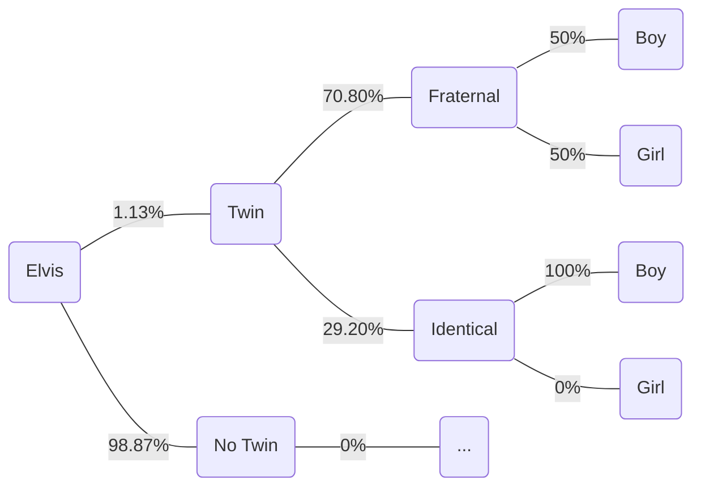

```
P(twin) & P(frat) = 1/125 = 0.8%
P(twin) & P(I) = 1/300 = 0.33%
P(twin) = 0.8% + 0.33% = 1.13% -> P(not twin) = 98.87%

P(frat|twin) = 0.8%/1.13%
P(I|twin) = 0.33%/1.13%

Elvis has twin brother. ->boy
P(boy) = (70.80% * 50%) + (29.20% * 100%) = 64.6%

Calculate P(I|boy) = P(boy|I).P(I)/P(boy)
= (100% * 29.20%)/64.6% = 45.20%

```

